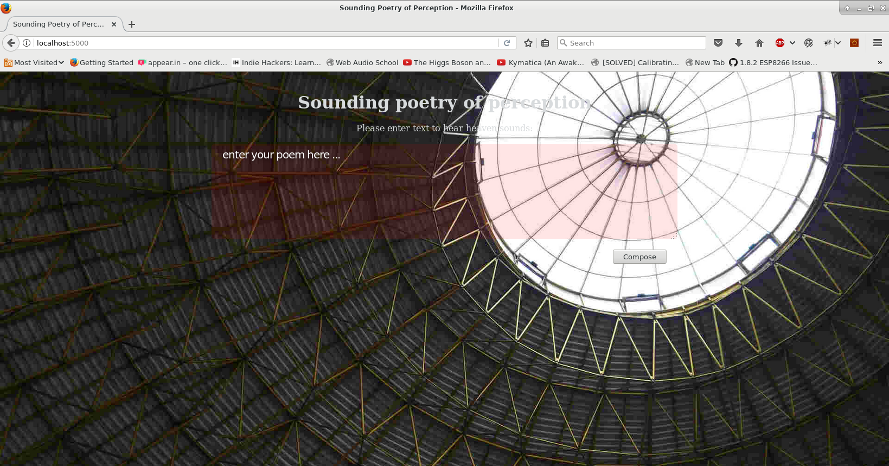

# Sounding Poetry of Perception

## Description
In Sounding Poetry, textual descriptions become a score for sound compositions, where different words correspond to field recordings and sounds. The created soundscape is composed by one’s interpretation of his/her own visual experience into words.

This repository will try to improve the original [project](https://github.com/pepaivanova/Sounding-Poetry-of-Perception/tree/master) and make it work as a stand alone website.

## View

## Tasks list

- [ ] Initial index.html 
- [ ] Load web audio 
- [ ] Configure mixing options of the sounds - tune some graphical interface  
- [ ] Get input text from the user
- [ ] Search engine for freesounds.org or couchdb database
- [ ] Load sound files to the local computer
- [ ] Mix sounds corresponding to the entered text with background music
- [ ] Play final sounds 
- [ ] Print a label with the entered text

## Authors

* Pepa Ivanova
* Radoslav Borisov
* Alex Milanov
